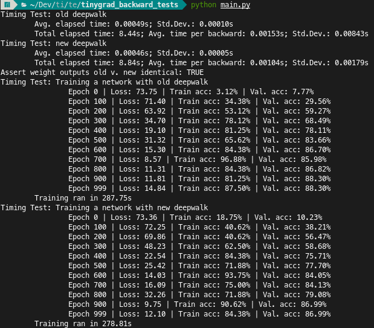

# Tests on the .backward() method of the Tensor object in Tinygrad

Modification is found in ``main.py``.

Tested on CPU:

- Grad output identical between old and new when tested on a weight tensor
- Seems to eke out 1-2% performance when training a small CNN

### View

